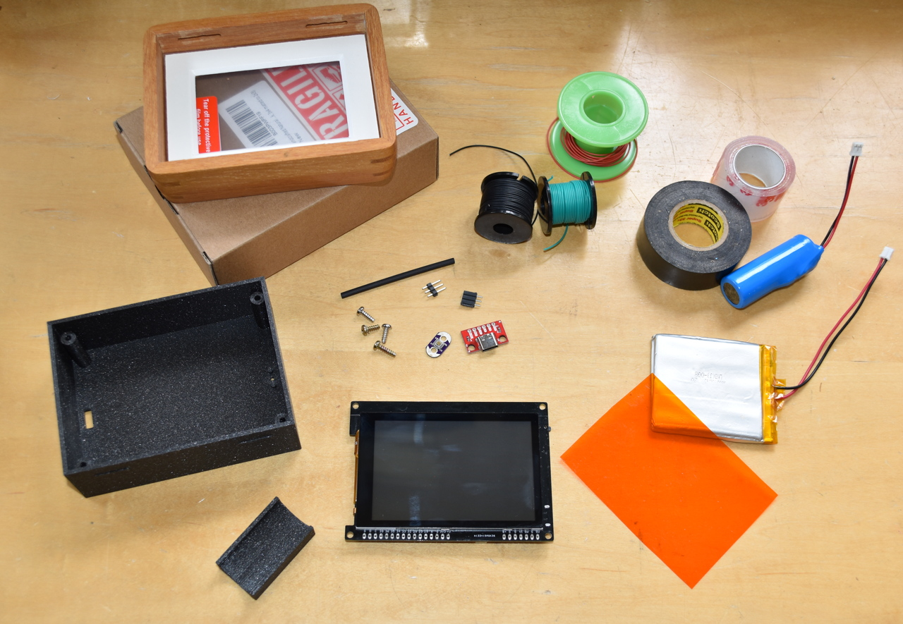
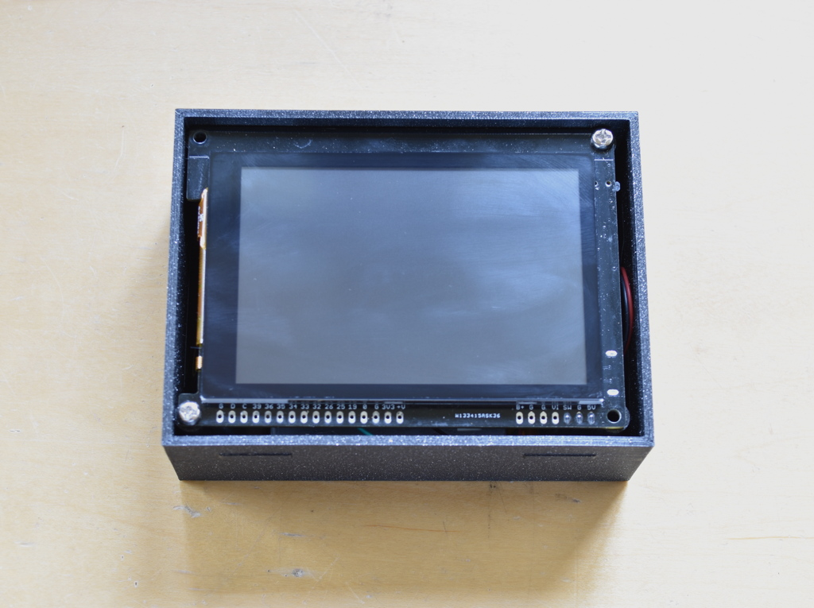

## Faux Nixie Clock
A "nixie" desk clock using high-quality bitmap images of the ten nixie numbers with Wifi allowing network-based time updates and a web-based control panel.


Firmware is written for the ESP32 running on gCore using the Espressif IDF utilizing LVGL for both the 3.5" (480x320 pixel) LCD display and the remote web-based control panel.  It is powered via a USB C 5V adapter and can have a battery backup function.

### Operation
The clock keeps time in a stand-alone fashion but can also access internet time servers to keep itself very accurate.  A rechargeable battery allows the clock to display the time for hours during a power failure.

By default the clock acts as a Wifi Access Point (AP) advertising a SSID of the form ```NixieClock-NNNN``` where NNNN are a set of 4 hexadecimal numbers from the ESP32's MAC address.  There is no password but one can be added.

Connect a mobile phone or desktop computer to the SSID and navigate to ```nixie.local``` in a web browser.  The control panel should appear.


Time can be directly set using the ```Time / Date``` control.  The Autoset button sets the time based on the connnected device's clock.


The ```Timezone``` control configures operation with the internet time servers by setting your timezone and daylight savings.

The ```Wi-Fi / Network``` control can be used to put the clock on a local network so that it can access internet time servers.  It can also be used to set a static IP address if desired but that generally isn't required if mDNS discovery is enabled (allowing access to the control panel using ```nixie.local```).


The gCore power button (which is extended in this build to an externally accessible button using the Lilypad button) has three functions.

1. Short press (< 1/2 second) turns the clock off (or turns it on if it is off).
2. Medium press (greater than 2 seconds) initiates a Wi-Fi reset re-enabling AP mode.
3. Long press (greater than 5 seconds) performs a hard power-off (useful if the ESP32 has crashed or locked up due to code changes).

The clock will power down when the internal battery reaches about 3.5V during a power fail or when not operating on a USB adapter.  It will automatically power on when the battery starts charging again.

### Parts


1. [gCore](https://www.tindie.com/products/globoy/gcore-high-end-esp32-graphics-dev-board/?pt=ac_prod_search)
2. 500-2000 mAh 3.7V Lipo [battery](https://www.sparkfun.com/lithium-ion-battery-1500mah-iec62133-certified.html) with Sparkfun/Adafruit polarity connector (can be either flat pouch cell or 18mm diameter round type)
3. USB C [Breakout](https://www.sparkfun.com/sparkfun-usb-c-breakout.html)
4. Lilypad [Button](https://www.sparkfun.com/lilypad-button-board.html)
5. 3-pin 0.1" header and 3-pin 0.1" socket
6. 30 AWG Hook-up wire
7. Shrink wrap tubing
8. 2x3" [picture frame](https://www.amazon.com/dp/B0D3PWPF19?th=1)
9. Orange Lighting [Gel filter](https://www.amazon.com/Sakolla-10Pcs-Colored-Lighting-Filters/dp/B09JNVH981/ref=sr_1_2_sspa?th=1) cut to around 85x62mm
10. 2-4 M2.5 machine screws
11. 3D printed enclosure (design files in ```enclosure```)
12. Tape - Black electrical, heavy-duty double sided  mounting tape, scotch or other transparent tape
13. Black spray paint

### Enclosure
The enclosure is designed for a particular picture frame but designed using OpenSCAD for easy modification.  There are also pre-compiled STL files ready for slicing.  I printed using a black PLA.


The OpenSCAD source also allows generating STL for a simple 18mm diameter battery holder (e.g. 18650 or 17500 style cel).  This can be glued or double-sticky tape bound to the main enclosure (toward base).  The battery held in place using a little tape.


### Assembly
Load the code into gCore (see ```Loading Firmware``` below).

Solder together the wiring harness connecting the USB Breakout board and Lilypad button to gCore's expansion header as shown below.  I used a header + socket to make this removable but you could just solder the wires to gCore.  I also used the heat shrink tubing to secure the wire connections to the header pins.


I used 5" wires for the USB Breakout board and 6" wires for the button board.

Mount the battery, USB Breakout and button in the enclosure.

1. Battery can be attached using double-sticky tape.
2. USB Breakout attached using double-sticky tape and then black electrical tape over the top to provide additional support.
3. Lilypad button can be staked to the mounting posts using a soldering iron and then covered with black electrical tape to provide additional support.


Plug in both the battery and switch/USB wiring assembly and then screw gCore into the enclosure base using 2 or 4 screws.



Paint the bezel black using spray paint.


Then tape the orange gel to the inside face of the bezel using the transparent tape.


Finally insert the front plastic shield, then the bezel into the picture frame (I threw away the remaining parts of the picture frame).


Carefully press the enclosure into the picture frame.  It will be tight.


### Loading firmware
Firmware is developed using the Espressif IDF and Enscripten.  Emscripten is used to build a web assembly program containing the control panel code that runs in the web browser.  It communicates with the ESP32 via a websocket.  The firmware may be loaded into gCore multiple ways.

1. Using my Linux/Mac/Windows gCore Serial Downloader application available [here](https://www.danjuliodesigns.com/products/gcore.html).
2. Using the Espressif [Windows-only] [download tool](https://docs.espressif.com/projects/esp-test-tools/en/latest/esp32/production_stage/tools/flash_download_tool.html) to flash the precompiled binaries found in the ```precompiled``` subdirectory here).
3. Using the IDF (either building the project or simply using their tool to flash the precompiled binaries found in the ```precompiled``` subdirectory here).

In all cases turn gCore on first so that its serial port used for programming can be enumerated by the host computer.

#### gCore Serial Downloader
Select ```Faux Nixie Clock``` and the serial port associated with gCore and click ```Program```.


#### Espressif download tool setup
Configure the download tool to load the following binary files at their associated locations.

| File | Location|
| --- | --- |
| bootloader.bin | 0x1000 |
| partition\_table.bin | 0x8000 |
| ota\_data\_initial.bin | 0xd000|
| faux\_nixie\_clock.bin | 0x10000 |


#### IDF build
Building the firmware requires the following development environments.

1. [Espressif IDF v5.3](https://docs.espressif.com/projects/esp-idf/en/release-v5.3/esp32/index.html)
2. [Emscripten](https://emscripten.org/) - I build with SDK 3.1.64 but later versions should work too.  I also had to install SDL2 (on mac: ```brew install sdl2```).

I build using Mac OS X but this project should be buildable on Linux and Windows platforms as well, perhaps with some changes to shell commands.

Building is a two-step process.

1. Build the HTML page that the camera sends to the browser using emscripten, compress it and copy it to the Espressif project.
2. Build the Espressif project and load the combined binary into the clock.

##### Emscripten build
Build the emscripten portion before building and programming the ESP32 portion.  This only needs to be done initially or when any part of the emscripten source changes.

1. One time only: change directory to the ```firmware/emscripten``` subdirectory and create a ```build``` directory there.
2. Change directory to ```firmware/emscripten/build``` subdirectory in a shell dedicated to building the emscripten portion of the firmware.
3. Source the emscripten ```emsdk_env.sh``` file to configure the emscripten environment.
4. First time and only when you add new source files to the emscripten build: run the command ```emcmake cmake ..```
5. Build the emscripten code: ```emmake make -j4```
6. Compress the resultant html file: ```gzip index.html```
7. Move the compressed file into the ESP32 build area: ```mv index.html.gz ../../components/web_assets```

##### ESP32 build
I build the ESP32 portion using another shell window.  The compressed HTML file must be built and stored in the ```components/web_assets``` subdirectory.

1. Change directory to the ```firmware``` subdirectory.
2. Build the project using the Espressif tools:```idf.py build```
3. Program the firmware using the command ```idf.py -p [PORT] -b 921600 flash``` where [PORT] is the name of the serial port associated with gCore.

#### IDF command line with precompiled binaries
With the IDF installed and sourced, change directory to the ```precompiled``` subdirectory and use the following command.

```
esptool.py --chip esp32 -p [PORT] -b 921600 --before=default_reset --after=hard_reset write_flash --flash_mode dio --flash_freq 80m --flash_size detect 0x1000 bootloader.bin 0x10000 faux_nixie_clock.bin 0x8000 partition-table.bin 0xd000 ota_data_initial.bin
```

Where ```[PORT]``` is the name of the serial port associated with gCore on your system.

### Firmware Architecture


### Possible Future work

1. Add alarm clock functionality.  Could use the Micro-SD card to store all kinds of alarm sounds.
2. Add I2C light sensor for automatic dimming.
3. Add support for OTA firmware updates.
4. Port to a real nixie tube clock!